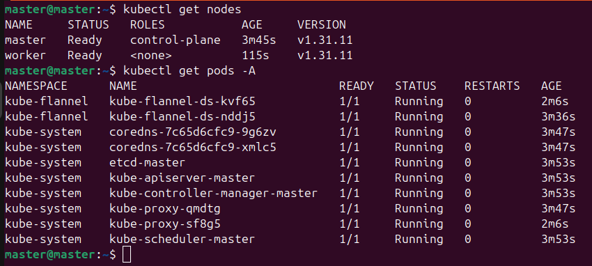
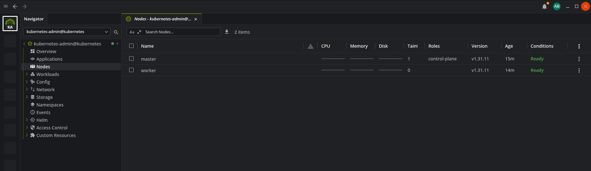

# Kubernetes Cluster Setup on Ubuntu 24.04 (Master &amp; Worker Nodes)

<div align="center">
    
</div>

This guide explains how to set up a Kubernetes cluster on **Ubuntu 24.04 LTS**, using **containerd** as the container runtime and `kubeadm` for cluster bootstrapping.  
It includes the required system setup, network configuration, and role-specific commands for **Master** and **Worker** nodes.


## Table of Contents

- [Step 1: System Configuration (All Nodes)](#step-1-system-configuration-all-nodes)
- [Step 2: Install containerd (All Nodes)](#step-2-install-containerd-all-nodes)
- [Step 3: Install Kubernetes Components (All Nodes)](#step-3-install-kubernetes-components-all-nodes)
- [Step 4: Initialize the Master Node (MASTER ONLY)](#step-4-initialize-the-master-node-master-only)
- [Step 5: Join Worker Nodes (WORKERS ONLY)](#step-5-join-worker-nodes-workers-only)
- [Step 6: Verify Your Cluster](#step-6-verify-your-cluster)
- [Step 7: (Optional) Visualize Your Cluster with Lens](#step-7-optional-visualize-your-cluster-with-lens)

## Step 1: System Configuration (All Nodes)

To enable required networking and resource management:

```bash
sudo iptables -P FORWARD ACCEPT

sudo swapoff -a

sudo ufw disable #NOT RECOMMENDED in PROD

sudo modprobe overlay
sudo modprobe br_netfilter

sudo tee /etc/modules-load.d/k8s.conf <<EOF
overlay
br_netfilter
EOF

sudo tee /etc/sysctl.d/k8s.conf <<EOF
net.bridge.bridge-nf-call-iptables  = 1
net.bridge.bridge-nf-call-ip6tables = 1
net.ipv4.ip_forward = 1
EOF

sudo sysctl --system
```

## Step 2: Install containerd (All Nodes)
We use containerd as the container runtime, recommended by Kubernetes.


```bash
sudo apt update
sudo apt install -y curl ca-certificates apt-transport-https containerd

sudo mkdir -p /etc/containerd
containerd config default | sudo tee /etc/containerd/config.toml

sudo sed -i 's/SystemdCgroup = false/SystemdCgroup = true/' /etc/containerd/config.toml

sudo systemctl restart containerd
sudo systemctl enable containerd
```

## Step 3: Install Kubernetes Components (All Nodes)
Add the official Kubernetes package repository:


```bash
curl -fsSL https://pkgs.k8s.io/core:/stable:/v1.31/deb/Release.key | \
  sudo gpg --dearmor -o /etc/apt/keyrings/kubernetes-apt-keyring.gpg

echo "deb [signed-by=/etc/apt/keyrings/kubernetes-apt-keyring.gpg] \
https://pkgs.k8s.io/core:/stable:/v1.31/deb/ /" | \
sudo tee /etc/apt/sources.list.d/kubernetes.list

sudo apt update
sudo apt install -y kubelet kubeadm
sudo apt install -y kubectl  # ONLY FOR MASTER
```

## Step 4: Initialize the Master Node (MASTER ONLY)
Run the following steps only on the master node.

1. Initialize the Cluster
We’ll use Flannel as the network plugin, so specify its CIDR:
```bash
sudo kubeadm init --pod-network-cidr=10.244.0.0/16
```
Save the kubeadm join command shown at the end — you’ll need it for the workers.

2. Configure kubectl for Your User
```bash
mkdir -p $HOME/.kube
sudo cp -i /etc/kubernetes/admin.conf $HOME/.kube/config
sudo chown $(id -u):$(id -g) $HOME/.kube/config
```
3. Install Flannel CNI
This allows pods to communicate within the cluster:
```bash
kubectl apply -f https://github.com/flannel-io/flannel/releases/latest/download/kube-flannel.yml
```

4. (Optional) Allow Scheduling on Master
Useful for single-node clusters:
```bash
kubectl taint nodes --all node-role.kubernetes.io/control-plane-
```

## Step 5: Join Worker Nodes (WORKERS ONLY)
Run this command on each **worker node** to join the cluster:
```bash
# Join the cluster using the command provided by `kubeadm init`
sudo kubeadm join <MASTER_IP>:6443 --token <TOKEN> --discovery-token-ca-cert-hash sha256:<HASH>
```
Replace <MASTER_IP>, <TOKEN>, and <HASH> with actual values.

## Step 6: Verify Your Cluster
Run these commands on the master node to check that everything is working:

```bash
kubectl get nodes
kubectl get pods -A
```

<div align="center">
    
</div>

## Step 7: (Optional) Visualize Your Cluster with Lens
Once your cluster is ready, use Lens — a powerful Kubernetes IDE — to manage your cluster visually instead of using `kubectl` in the CLI.

1. **Download Lens**: [https://k8slens.dev/download](https://k8slens.dev/download)  
2. **Launch the application.**  
3. Lens will automatically detect your kubeconfig file (`~/.kube/config`).  
4. Click **“Add Cluster”** and select your cluster from the list.  
5. You're ready to view **workloads, logs, nodes, CPU/memory usage**, and much more — all in a visual interface.

<div align="center">
    
</div>


